# Employee App

## Overview

The Employee App is a simple Django application that manages employee clock-in and clock-out times. It includes a web interface for employee to show clock in and out times, as well as an admin interface to manage employee data and view clock-in records.

## Screenshots
### Large screen view:
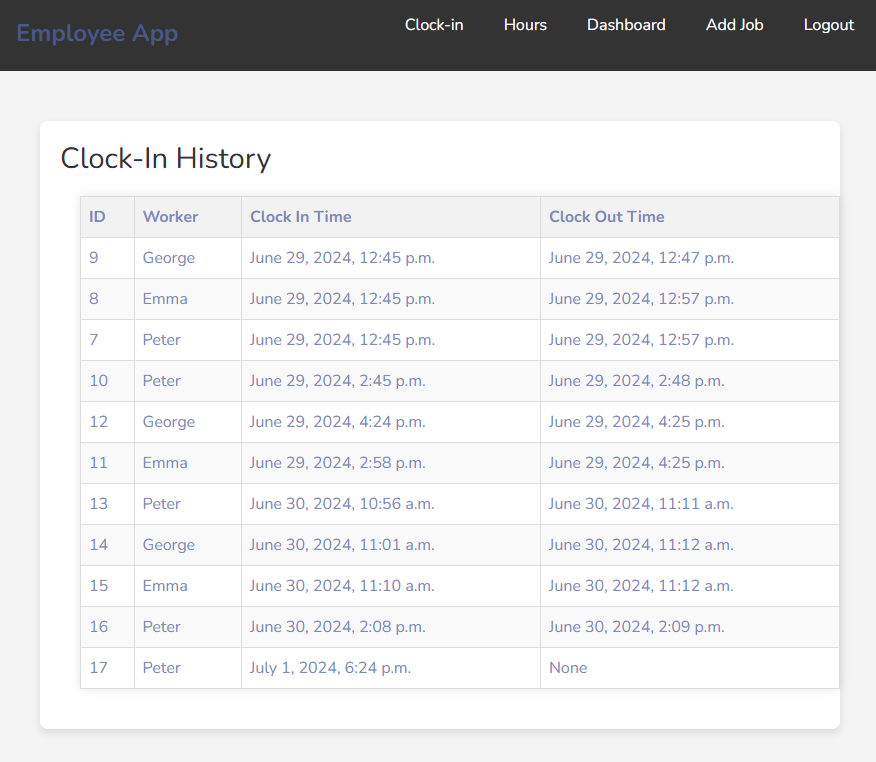
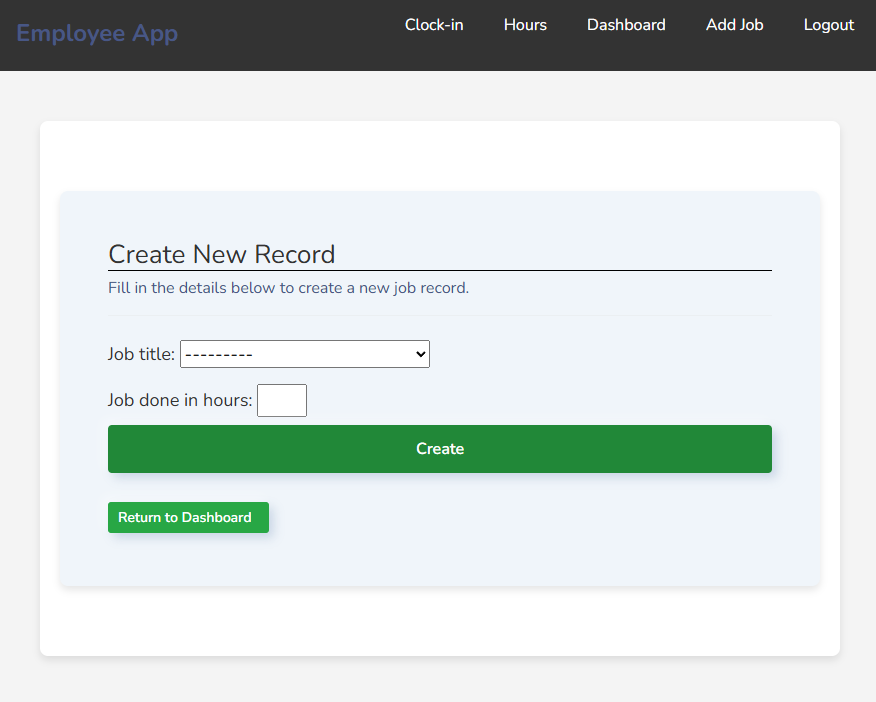
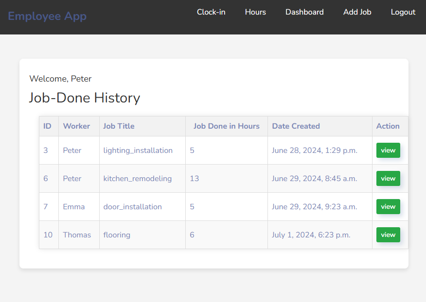
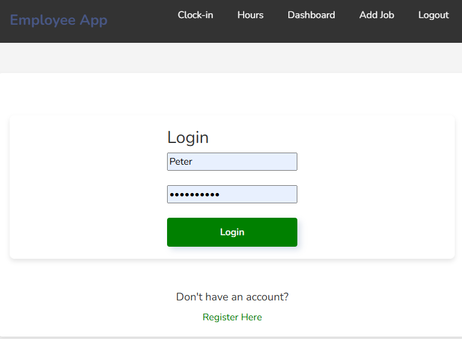
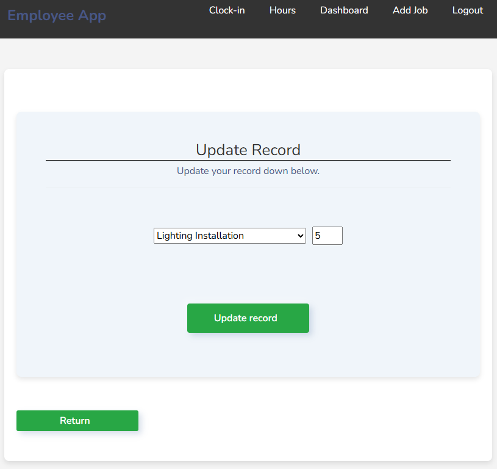
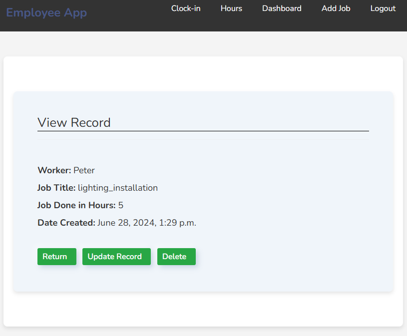
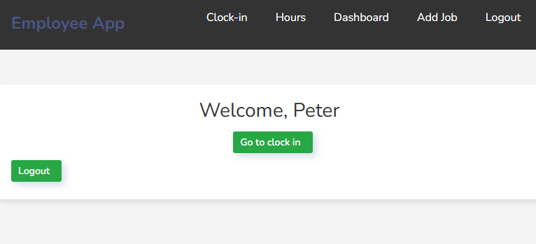

### mobile view:
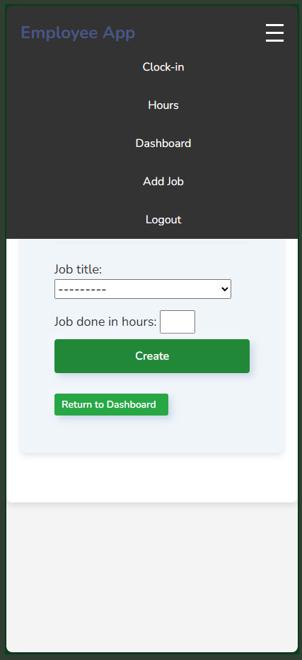 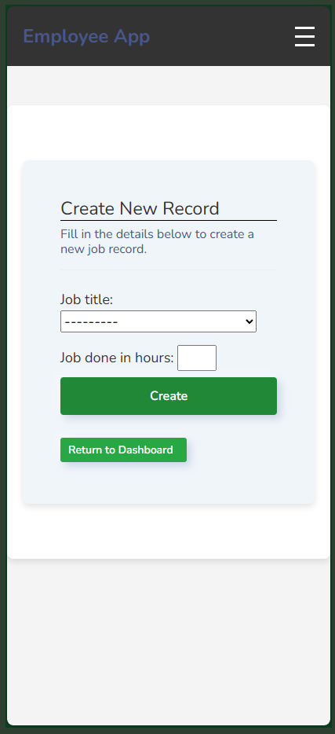

## Directory Structure

- `employeeapp/`: Contains the main application code.
- `manage.py`: The command-line utility for administrative tasks.
- `db.sqlite3`: The SQLite database file.
- `requirements.txt`: Lists the dependencies required for the project.
- `Procfile`: Configuration for deploying the app to Heroku or similar platforms.
- `clockin/`: Directory for clock-in related features and templates.

## Testing
UI has been tested manually, no unittesting involved.
During manual testing there was no bug found.
### CSS Checker:
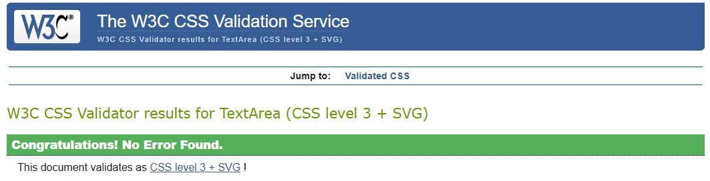
### PEP8 Checker:
####forms.py:
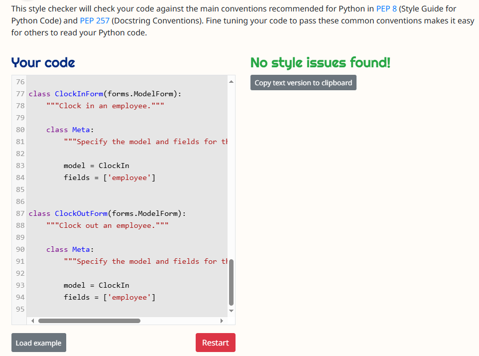
####urls.py:
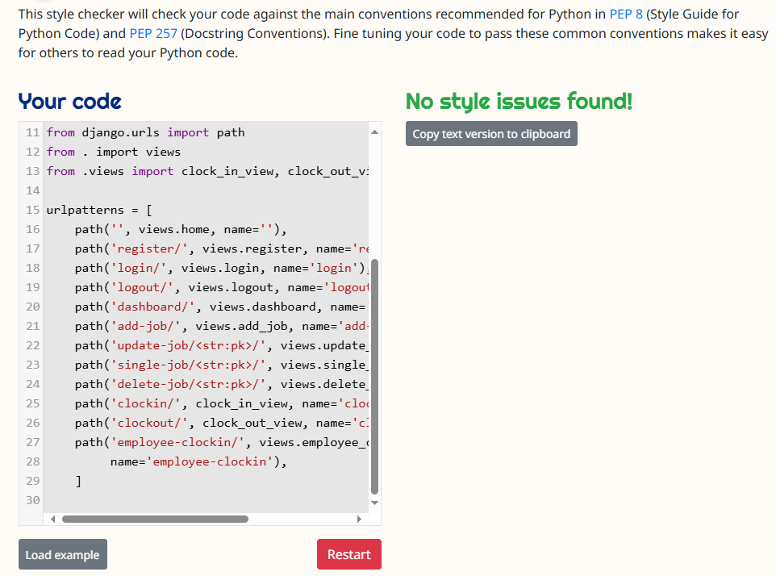
####views.py
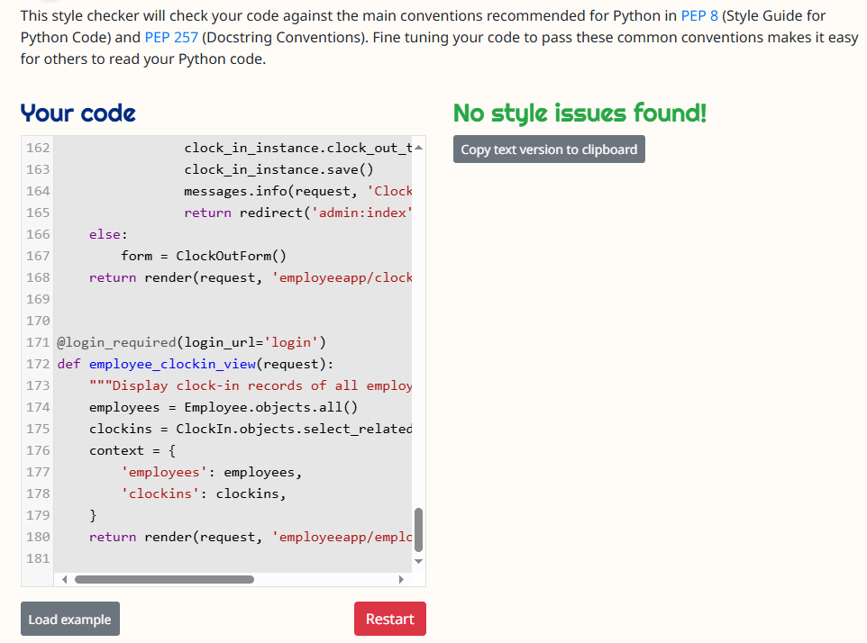

## Sources
- [Icon Converter](https://www.icoconverter.com/):Great to make favicons
- [Font Awesome](https://fontawesome.com/account/general):Great for free icons
- [Bootstrap](https://getbootstrap.com/docs/5.3/getting-started/introduction/):Bootstrap source
- [Bootstrap](https://startbootstrap.com/):Bootstrap source
- [Image Color Picker](https://imagecolorpicker.com/): Used for selecting a harmonious color palette. 
- [GPT-4](https://chat.openai.com/?model=gpt-4): Utilized for generating images, texts, and providing explanations of elements.
- [Google](www.google.com): Employed for image research.
- [YouTube](www.youtube.com):multiple tutorials


## Setup Instructions

### Prerequisites

- Python 3.x
- Django
- SQLite (or another database if you prefer)
- Virtualenv (recommended)

### Installation

1. **Clone the repository:**
    ```bash
    git clone <repository-url>
    cd employeeapp-ver6-main
    ```

2. **Create and activate a virtual environment:**
    ```bash
    python -m venv venv
    source venv/bin/activate  # On Windows use `venv\Scripts\activate`
    ```

3. **Install the dependencies:**
    ```bash
    pip install -r requirements.txt
    ```

4. **Apply the migrations:**
    ```bash
    python manage.py migrate
    ```

5. **Create a superuser:**
    ```bash
    python manage.py createsuperuser
    ```

6. **Run the development server:**
    ```bash
    python manage.py runserver
    ```

7. **Access the application:**
    Open a web browser and go to `http://127.0.0.1:8000/`.

## Deployment

### Using Heroku

1. **Install the Heroku CLI:**
    Follow the instructions at https://devcenter.heroku.com/articles/heroku-cli

2. **Login to Heroku:**
    ```bash
    heroku login
    ```

3. **Create a new Heroku app:**
    ```bash
    heroku create
    ```

4. **Deploy the app:**
    ```bash
    git push heroku main
    ```

5. **Run database migrations on Heroku:**
    ```bash
    heroku run python manage.py migrate
    ```

6. **Create a superuser on Heroku:**
    ```bash
    heroku run python manage.py createsuperuser
    ```

## Usage

- **Admin Interface:** Access the admin interface at `http://127.0.0.1:8000/admin` to manage employee data.
- **Clock-in Interface:** Employees can clock in and out using the interface at the root URL `http://127.0.0.1:8000/`.

## Contributing

1. Fork the repository.
2. Create a new branch: `git checkout -b feature/your-feature-name`.
3. Make your changes and commit them: `git commit -m 'Add some feature'`.
4. Push to the branch: `git push origin feature/your-feature-name`.
5. Open a pull request.

## Contact Information
For further inquiries or feedback, please contact:

Peter Rimaszecsi
Email: rim.peter@hotmail.com
